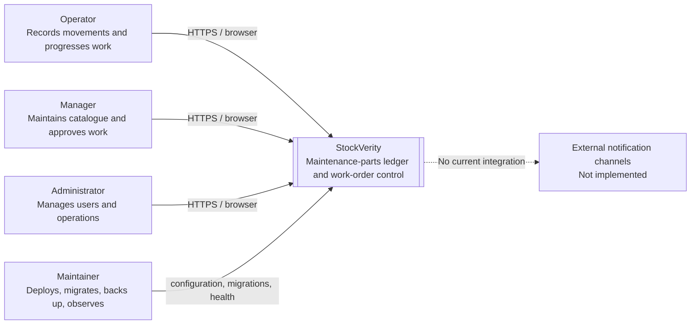

# C4 level 1 — system context

## Boundary notes

- StockVerity is the system of record only for its own product, movement,
  work-order, user, and filter data.
- Purchasing, finance, HR identity, and regulatory audit services are outside
  the current boundary.
