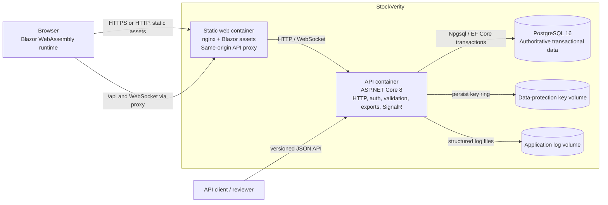

# C4 level 2 — containers

```mermaid
flowchart LR
    browser["Browser\nBlazor WebAssembly runtime"]
    reviewer["API client / reviewer"]

    subgraph system[StockVerity]
      web["Static web container\nnginx + Blazor assets\nSame-origin API proxy"]
      api["API container\nASP.NET Core 8\nHTTP, auth, validation, exports, SignalR"]
      db[("PostgreSQL 16\nAuthoritative transactional data")]
      keys[("Data-protection key volume")]
      logs[("Application log volume")]
    end

    browser -->|HTTPS or HTTP, static assets| web
    browser -->|/api and WebSocket via proxy| web
    web -->|HTTP / WebSocket| api
    reviewer -->|versioned JSON API| api
    api -->|Npgsql / EF Core transactions| db
    api -->|persist key ring| keys
    api -->|structured log files| logs
```

The UI and API are separately deployable containers but one product release.
PostgreSQL is not embedded in the API image.
