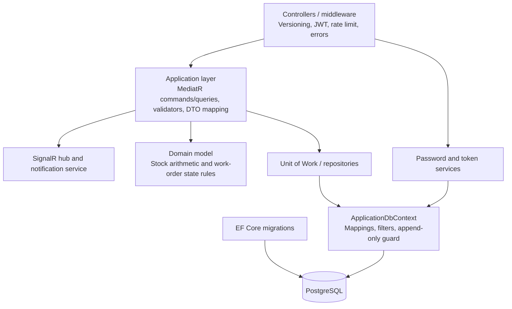

# C4 level 3 — API components

## Integrity path

For a stock operation, the controller sends a validated command to its handler.
The handler detects an operation-ID replay, loads the product/work order,
applies domain rules, appends a movement with balance snapshots, updates the
balance, and calls one unit-of-work save. PostgreSQL constraints and `xmin`
provide the final persistence boundary.
