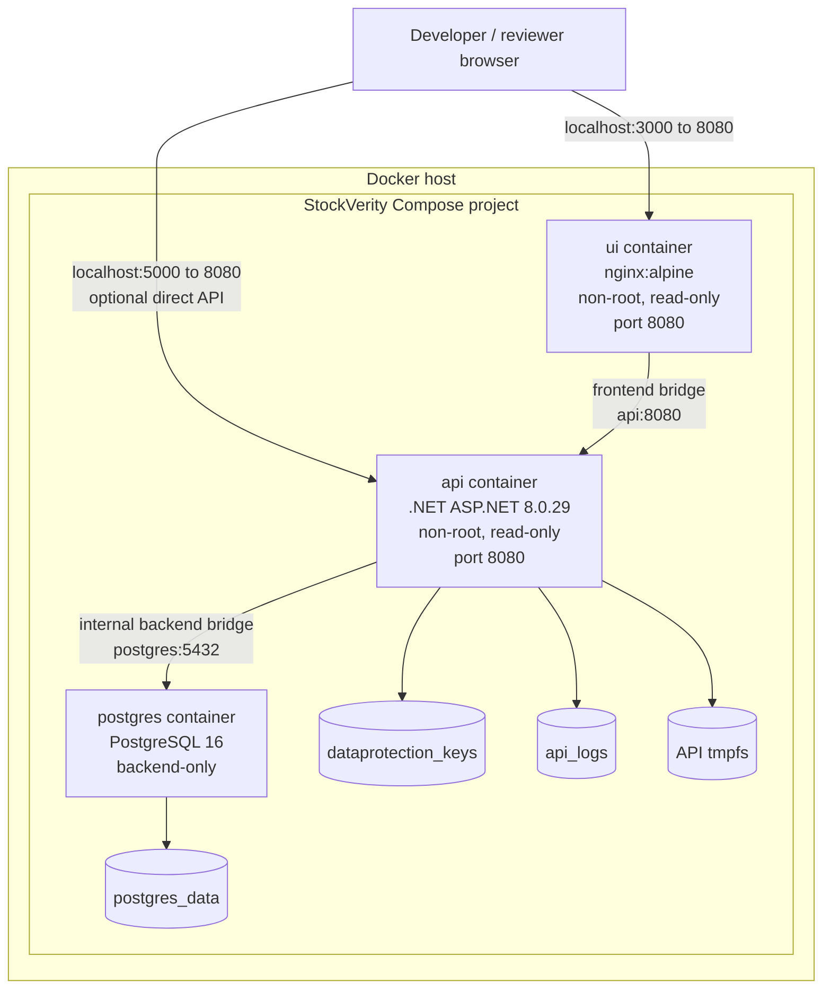

# C4 level 4 — local evidence deployment

This is a demo/evidence topology. A production deployment should terminate TLS,
manage secrets externally, apply migrations as a controlled release step,
back up PostgreSQL, and collect logs centrally.
